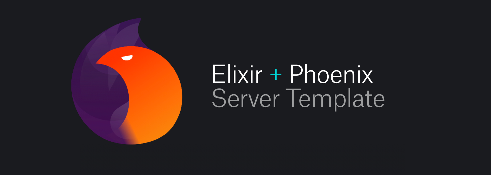

[](https://ynd.co)
[](https://medium.com/@ynd/bootstrapping-your-next-elixir-phoenix-project-166b65262aa8)

<br />

[](https://twitter.com/yndconsult)
 <a href="https://Jenkins.io/">
    
  </a>

<h3>
  <a href="https://ynd.co">
    YND
  </a>
  <span> | </span>
  <a href="http://phoenixframework.org/">
    Elixir Phoenix
  </a>
  <span> | </span>
  <a href="https://dcos.io/">
    DC/OS
  </a>
  <span> | </span>
  <a href="https://mesosphere.github.io/marathon/">
    Marathon
  </a>
  <span> | </span>
  <a href="https://www.docker.com/">
    Docker
  </a>
  <span> | </span>
  <a href="https://Jenkins.io/">
    Jenkins
  </a>
  <span> | </span>
  <a href="https://sentry.io/">
    Sentry
  </a>
  <span> | </span>
  <a href="https://www.graylog.org/">
    Graylog
  </a>
</h3>

## Table of Contents
- [Features](#features)
- [Prerequisites](#prerequisites)
- [Setup](#setup)
- [Usage](#usage)
- [Support](#support)
- [License](#license)

## Features
- __DC/OS cluster:__ cluster built using Mesosphere DC/OS 1.10
- __load balancing:__ load balancing and autoscaling is handled by marathon-lb
- __CI:__ continuous delivery with Jenkins
- __log management:__ Graylog for log aggregation
- __error tracking:__ manage errors with Sentry
- __development setup:__ start coding within minutes - seamless developer experience thanks to Docker & docker-compose

## Prerequisites
- DC/OS cluster running with marathon-lb plugin enabled
- Jenkins up and running
- Sentry up and running
- Graylog up and running
- Docker registry up and running (or one could use https://hub.docker.com/)
- Docker & docker-compose installed on developer host machine


## Setup
### Jenkinsfile
Setting up the production environment requires some credentials in Jenkins to be setup first. Please check the `Jenkinsfile` included in repo.
Credentials to be added:

* `YND_PHX_REGISTRY_URL` docker registry URL
* `YND_PHX_REGISTRY_CREDS` docker registry credentials
* `YND_PHX_DCOS_DR` first part of docker image tag if you are pushing to private docker registry it should point to hostname of your private docker registry
* `YND_PHX_MARATHON_URL` marathon service url
* `YND_PHX_MARATHON_ID` marathon application name identifier
* `YND_PHX_DCOS_CREDS` marathon credentials

### `marathon.json` and `marathon-db.json`
We use Jenkins config file provider plugin to provide ad hoc build configuration for orchestration platform. We have provided two example files (`marathon.json.example`, `marathon-db.json.example`) to ilustrate how the setup might look like. 

Proper configuration files based on those templates has to be submitted to Jenkins credentials as Secret files, with ids `YND_PHX_MARATHON_JSON` and `YND_PHX_MARATHON_DB_JSON` respectively.

Excerpt of `marathon.json` configuration options

* `id` it should match the `marathon_id` from Jenknisfile
* `container.docker.image` tag name of docker image you wish to pull from docker registry
* `container.portMappings.name` name of your app in DC/OS
* `env` those env variables are accessible in your container and used by binary elixir phoenix release. You probably want to alter all of the variables here except `MIX_ENV` and `PORT`. `SENTRY_ENDPOINT` is also know as sentry dsn.
* `labels.HAPROXY_0_VHOST`

Excerpt of `marathon-db.json` configuration options

* `id` identifier of the postgresql database service in DC/OS
* `container.portMappings.name` name of postgresql database service in DC/OS
* `env.POSTGRES_USER` this env variable should match `env.DB_REPO_USER` in `marathon.json` file
* `env.POSTGRES_PASSWORD` this env variable should match `env.DB_REPO_PASSWORD` in `marathon.json** file

## Usage
### Development
To run commands in development you need to have working `.env` file
```bash
$ cp .env.example .env
```

Install the dependencies and compile
```bash
$ docker-compose run --rm app mix do deps.get, compile
```

Start the server on port 4000
```bash
$ docker-compose up
```

Run tests
```bash
$ docker-compose run --rm app mix test
```

## License

Elixir Phoenix Bootstrap is released under MIT license. See [LICENSE](LICENSE) for details.

## Looking for developers for your project?

[](mailto:hello@ynd.co)

## Follow us

[](https://twitter.com/intent/tweet?text=https://github.com/ynd-consult-ug/ynd-phx-bootstrap)
[](https://twitter.com/yndconsult)